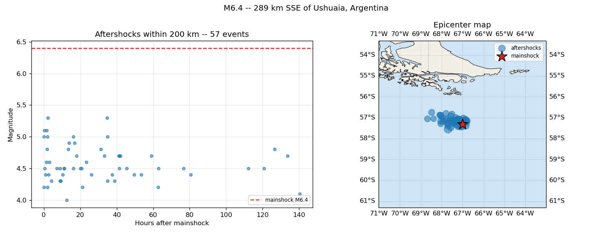
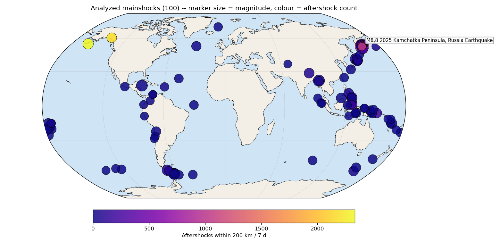
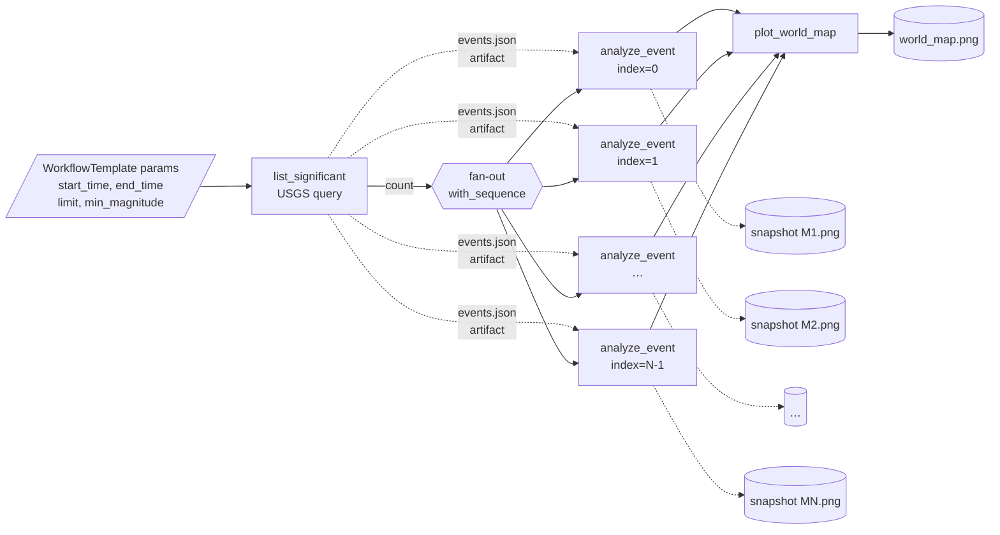

# Hera Workflows: from Python functions to distributed scientific pipelines

> **Case study:** Aftershock sequences around recent significant earthquakes, sourced from the public **USGS FDSN event** API - one analysis per mainshock, in parallel, with per-event diagnostic figures (including a real GIS epicenter map) and a final cross-event **world map** of every analyzed mainshock. Packaged as a **`WorkflowTemplate`** parameterised by `start_time` / `end_time` / `limit` / `min_magnitude`, so the same template can be re-submitted with different windows.

---

## 1. Learning outcomes

By the end of the session, participants will be able to:

1. Explain what **Hera** is and how it relates to **Argo Workflows** and **Kubernetes**.
2. Write a Python function as a workflow step using the `@script()` decorator.
3. Build a **DAG** that contains a **dynamic parallel fan-out** (`with_sequence`) driven by an upstream discovery step that publishes its full payload as an **artifact** - the canonical data-pipeline pattern, scaled past Argo's parameter-size limit.
4. Produce and view **visual artifacts** (matplotlib plots, including real-projection GIS maps with cartopy) directly from a workflow run, with **inline previews** in the Argo UI via `archive: none`.
5. Promote a one-shot `Workflow` to a re-usable, parameterised **`WorkflowTemplate`** and submit it with different inputs (`start_time`, `end_time`, `limit`, `min_magnitude`).

---

## 2. Prerequisites & setup (do *before* the workshop)

| Requirement                                            | Notes                                                                                                                                 |
| ------------------------------------------------------ | ------------------------------------------------------------------------------------------------------------------------------------- |
| Python ≥ 3.9                                           | virtualenv or conda env                                                                                                               |
| `pip install hera-workflows`                           | latest Hera (v5+) - runtime deps (numpy, matplotlib) come from the public container image                                             |
| Access to an Argo Workflows cluster                    | any cluster works                                                                                                                     |
| `ARGO_SERVER`, `ARGO_TOKEN`, `ARGO_NAMESPACE` env vars | from your own cluster - your auth provider or `kubectl -n argo create token argo-server`                                              |
| Argo `artifactRepository` allowing `archive: none`     | required so the UI can render the snapshot/world-map PNGs inline rather than as `.tgz` downloads (the default S3/MinIO setup is fine) |

A 10-minute pre-flight script `setup_check.py` is provided - participants run it before they arrive; instructor helps stragglers during the first break.

---

## 3. Reference code

### 3.1 Hello Hera

[Hello world, source code](reference/hello-hera.py)

### 3.2 DAG diamond (used at 0:20)

[DAG, source code](reference/dag-hera.py)

### 3.3 Workflow template

[Workflow template, source code](reference/workflow-template-hera.py)

### 3.4 Fan-in / Fan-out

[Workflow fan-in/fan-out](reference/fanin-fanout-hera.py)

### 3.5 Loops

[Loops in workflow](reference/loops-hera.py)

---

## 4. The pipeline we will build

### 4.1 The experiment
We will explore **aftershock sequences** around every catalogued M≥`{{min_magnitude}}` earthquake between `{{start_time}}` and `{{end_time}}` - both bounds, the magnitude threshold and the result `limit` come from `WorkflowTemplate` parameters, so the same template can be re-submitted for any window.
The data comes from the public **USGS FDSN event web service** at `https://earthquake.usgs.gov/fdsnws/event/1/query`.
A single `GET` returns GeoJSON; no auth, no key, no rate-limit headaches for a workshop room.

For each mainshock we will fetch every other catalogued event within a 200 km radius and the following 7 days, render a two-panel diagnostic figure (magnitude-vs-time scatter on the left, **real GIS epicenter map** with coastlines / borders / land-ocean shading via cartopy on the right), and emit a flat summary (count, plus the mainshock's lat/lon for the fan-in).



At the end we render a single **global world map** with every analyzed mainshock plotted on a Robinson projection - marker size encodes magnitude and colour encodes the number of aftershocks - so a single look tells the participant where the busy regions were during the query window.





Complete solution code is provided in [the solution file](solution/workshop.py), but we will build it up piece by piece during the exercises.

### 4.2 First step: list_significant

```python
# FIXME: Add the `@script` decorator with appropriate inputs/outputs/image
def list_significant(start_time: str, end_time: str, limit: int, min_magnitude: float):
    """Query USGS for the M>=min_magnitude earthquakes catalogued between
    start_time and end_time, returning a list of events sorted by
    magnitude (descending) and truncated to the top `limit`.
    """
    import json
    import urllib.parse
    import urllib.request

    params = {
        "format":       "geojson",
        "starttime":    start_time,
        "endtime":      end_time,
        "minmagnitude": str(min_magnitude),
        "orderby":      "magnitude",
        "limit":        str(limit),
    }
    url = "https://earthquake.usgs.gov/fdsnws/event/1/query?" + urllib.parse.urlencode(params)
    with urllib.request.urlopen(url, timeout=60) as resp:
        payload = json.load(resp)

    events = []
    for feat in payload["features"]:
        lon, lat, depth = feat["geometry"]["coordinates"]
        events.append({
            "id":       feat["id"],
            "mag":      feat["properties"]["mag"],
            "place":    feat["properties"]["place"],
            "time_ms":  feat["properties"]["time"],
            "lon":      lon,
            "lat":      lat,
            "depth_km": depth,
        })

    # FIXME: what is the resulting of this step?
```


### 4.3 Second step: analyze_event

```python
# FIXME: Add the `@script` decorator with appropriate inputs/outputs/image
def analyze_event(index: int):
    """For one mainshock, fetch every USGS-catalogued event within 200 km
    and the following 7 days, and render its aftershock sequence.

    The mainshock's epicenter (lat, lon) gates the spatial query and its
    origin time gates the temporal query -- so the result captures both
    productivity (how many) and decay (how fast they tail off) for that
    single event in isolation.
    """
    import subprocess
    import sys
    # cartopy isn't in the base image, so we need to install it at runtime.
    subprocess.check_call([sys.executable, "-m", "pip", "install", "--quiet", "cartopy"])

    import collections
    import json
    import math
    import urllib.parse
    import urllib.request
    from datetime import datetime, timedelta, timezone
    import matplotlib
    matplotlib.use("Agg")
    import matplotlib.pyplot as plt
    import cartopy.crs as ccrs
    import cartopy.feature as cfeature

    with open("/tmp/events.json") as f:
        event = json.load(f)[index]

    event_id = event["id"]
    event_mag = event["mag"]
    event_place = event["place"]
    event_lon = event["lon"]
    event_lat = event["lat"]
    event_time_ms = event["time_ms"]

    main_time = datetime.fromtimestamp(event_time_ms / 1000, tz=timezone.utc)
    end_time = main_time + timedelta(days=7)
    params = {
        "format":      "geojson",
        "starttime":   main_time.isoformat(),
        "endtime":     end_time.isoformat(),
        "latitude":    str(event_lat),
        "longitude":   str(event_lon),
        "maxradiuskm": "200",
        "orderby":     "time",
        "limit":       "5000",
    }
    url = "https://earthquake.usgs.gov/fdsnws/event/1/query?" + urllib.parse.urlencode(params)
    with urllib.request.urlopen(url, timeout=120) as resp:
        payload = json.load(resp)

    aftershocks = []
    for feat in payload["features"]:
        if feat["id"] == event_id:
            continue
        t = datetime.fromtimestamp(feat["properties"]["time"] / 1000, tz=timezone.utc)
        hours = (t - main_time).total_seconds() / 3600
        if hours <= 0:
            continue
        lon, lat, _ = feat["geometry"]["coordinates"]
        aftershocks.append({
            "mag":   feat["properties"]["mag"],
            "hours": hours,
            "lon":   lon,
            "lat":   lat,
        })

    slope = None
    if len(aftershocks) >= 5:
        bins = collections.Counter(int(a["hours"]) for a in aftershocks)
        xs = sorted(b for b in bins if b >= 0)
        ys = [bins[b] for b in xs]
        if len(xs) >= 3:
            lx = [math.log10(x + 1) for x in xs]
            ly = [math.log10(y) for y in ys]
            n = len(lx)
            mx = sum(lx) / n
            my = sum(ly) / n
            num = sum((lx[i] - mx) * (ly[i] - my) for i in range(n))
            den = sum((lx[i] - mx) ** 2 for i in range(n)) or 1.0
            slope = num / den

    label = "M{:.1f} -- {}".format(event_mag, event_place)
    mainshock_label = "mainshock M{:.1f}".format(event_mag)

    fig = plt.figure(figsize=(13, 5))
    ax1 = fig.add_subplot(1, 2, 1)
    if aftershocks:
        ax1.scatter([a["hours"] for a in aftershocks],
                    [a["mag"] for a in aftershocks],
                    s=20, alpha=0.6, color="tab:blue")
        ax1.axhline(event_mag, color="tab:red", linestyle="--",
                    label=mainshock_label)
        ax1.set_xlabel("Hours after mainshock")
        ax1.set_ylabel("Magnitude")
        ax1.set_title(f"Aftershocks within 200 km -- {len(aftershocks)} events")
        ax1.grid(True, alpha=0.3)
        ax1.legend(fontsize=8)
    else:
        ax1.text(0.5, 0.5, "No aftershocks in window",
                 ha="center", va="center")
        ax1.axis("off")

    pad = 4.0
    proj = ccrs.PlateCarree()
    ax2 = fig.add_subplot(1, 2, 2, projection=proj)
    ax2.set_extent([event_lon - pad, event_lon + pad,
                    event_lat - pad, event_lat + pad],
                   crs=proj)
    ax2.add_feature(cfeature.OCEAN, facecolor="#cfe4f5")
    ax2.add_feature(cfeature.LAND, facecolor="#f3efe6")
    ax2.add_feature(cfeature.COASTLINE, linewidth=0.6)
    ax2.add_feature(cfeature.BORDERS, linewidth=0.4, linestyle=":")
    ax2.gridlines(draw_labels=True, linewidth=0.3, alpha=0.5,
                  color="grey")

    if aftershocks:
        ax2.scatter([a["lon"] for a in aftershocks],
                    [a["lat"] for a in aftershocks],
                    s=[max(8, a["mag"] ** 3) for a in aftershocks],
                    alpha=0.55, color="tab:blue", label="aftershocks",
                    transform=proj, zorder=3)
    ax2.scatter(event_lon, event_lat, s=280, marker="*",
                color="tab:red", edgecolors="black",
                label="mainshock", transform=proj, zorder=4)
    ax2.set_title("Epicenter map")
    ax2.legend(fontsize=8, loc="upper right")

    fig.suptitle(label)
    fig.tight_layout()

    # First output: the snapshot PNG
    plt.savefig("/tmp/snapshot.png", dpi=120)

    # FIXME: what is the second output of this step, and how do we produce it?
```

### 4.4 Final step: plot_world_map

```python
def plot_world_map(results_json):
    """Global overview of every analyzed mainshock on a single world map.

    Marker size scales with mainshock magnitude; colour encodes the number
    of catalogued aftershocks within 200 km / 7 days. The geographic view
    tells the participant at a glance where activity clustered during the
    query window, which is much easier to read than the Bath / Omori
    scatter plots the previous step produced.
    """
    import subprocess
    import sys
    subprocess.check_call([sys.executable, "-m", "pip", "install", "--quiet", "cartopy"])

    import json
    import matplotlib
    matplotlib.use("Agg")
    import matplotlib.pyplot as plt
    import cartopy.crs as ccrs
    import cartopy.feature as cfeature

    # Argo aggregates each iteration's stdout into a JSON array of strings;
    if isinstance(results_json, str):
        results_json = json.loads(results_json)
    items = [json.loads(s) if isinstance(s, str) else s for s in results_json]

    proj = ccrs.Robinson()
    data_proj = ccrs.PlateCarree()
    fig = plt.figure(figsize=(13, 6.5))
    ax = fig.add_subplot(1, 1, 1, projection=proj)
    ax.set_global()
    ax.add_feature(cfeature.OCEAN, facecolor="#cfe4f5")
    ax.add_feature(cfeature.LAND, facecolor="#f3efe6")
    ax.add_feature(cfeature.COASTLINE, linewidth=0.5)
    ax.gridlines(linewidth=0.3, alpha=0.4, color="grey")

    if items:
        lons = [d["lon"] for d in items]
        lats = [d["lat"] for d in items]
        mags = [d["mag"] for d in items]
        counts = [d.get("n_aftershocks", 0) for d in items]
        sizes = [max(40, (m ** 3.0)) for m in mags]

        sc = ax.scatter(lons, lats, s=sizes, c=counts,
                        cmap="plasma", alpha=0.85,
                        edgecolors="black", linewidths=0.6,
                        transform=data_proj, zorder=3)
        cbar = fig.colorbar(sc, ax=ax, orientation="horizontal",
                            shrink=0.6, pad=0.05)
        cbar.set_label("Aftershocks within 200 km / 7 d")

        top = max(items, key=lambda d: d["mag"])
        top_mag = top["mag"]
        top_place = top["place"]
        top_label = "M{:.1f} {}".format(top_mag, top_place)
        ax.annotate(top_label,
                    xy=(top["lon"], top["lat"]),
                    xycoords=data_proj._as_mpl_transform(ax),
                    xytext=(8, 8), textcoords="offset points",
                    fontsize=9, color="black",
                    bbox=dict(boxstyle="round,pad=0.2",
                              fc="white", ec="grey", alpha=0.8))

        ax.set_title("Analyzed mainshocks ({}) -- "
                     "marker size = magnitude, colour = aftershock count"
                     .format(len(items)))
    else:
        ax.set_title("No mainshocks returned by list_significant")

    fig.tight_layout()

    # This is the workflow's final output
    plt.savefig("/tmp/world_map.png", dpi=120)
```

### 4.5 The full workflow

Now we have the building blocks, we can assemble them into a `Workflow` and then promote that to a `WorkflowTemplate` for re-use with different parameters.

---

## 5. Resources

- Hera docs - <https://hera.readthedocs.io>
- Argo Workflows docs - <https://argo-workflows.readthedocs.io>
- USGS FDSN event web service - <https://earthquake.usgs.gov/fdsnws/event/1/>
- ArgoCon EU 2024 talk *"Orchestrating Python Functions Natively with Hera"* - <https://pipekit.io/blog/orchestrating-python-functions-natively-argo-hera>

---

## 6. Future directions

If you want to take the workshop code further, here are some ideas for next steps:

1. **Stretch - failure injection.** Add `retry_strategy=RetryStrategy(limit=2)` to `analyze_event`. Force one iteration to fail (e.g. point its URL at `https://earthquake.usgs.gov/does-not-exist`) and observe Argo's retry behaviour live.
2. **Stretch - caching.** Add `memoize=Memoize(...)` on `analyze_event` keyed by the event id, resubmit, and observe that previously-seen events are skipped on re-runs.
